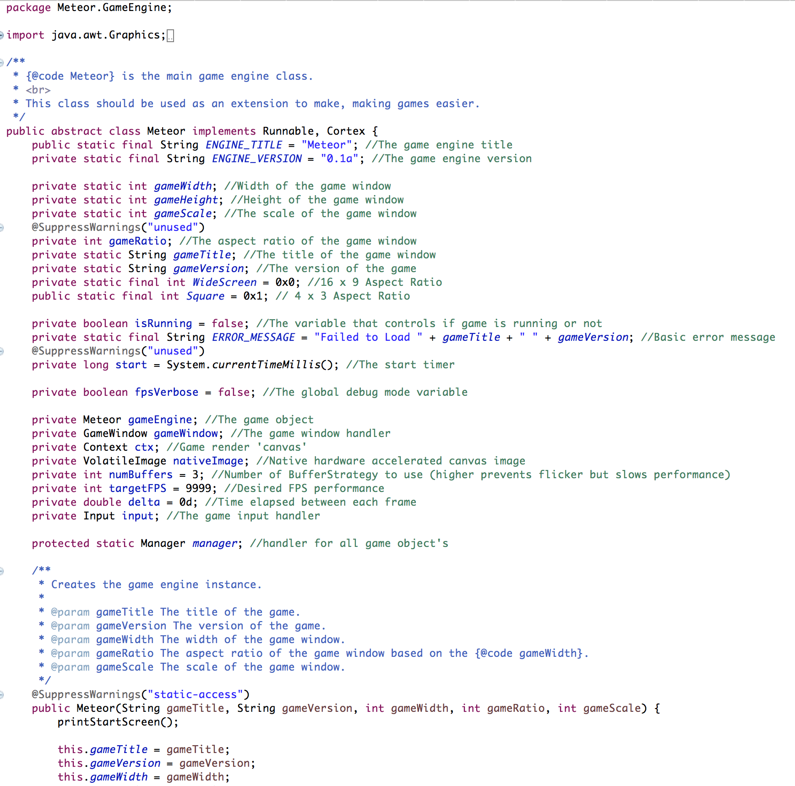

# Meteor

## About

Meteor is a Java 2D Pixel Rendering Game Engine, whose primary purpose is to be used as a starting point for any java 2D game. It has all of the necessities, such as Sprite Injection, Audio Injection, Bitmap Font Injection, Game State Management, and more.

## Install

In order to start using this engine, you will need to clone/download it to your machine.
